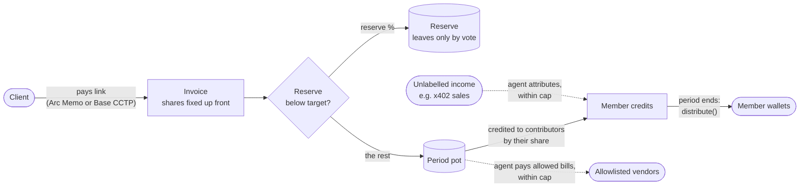

<div align="center">

# Keyarc

**A shared treasury on Arc for teams that earn together.**

Paid for the work you did. Rules nobody can bend.

[Live app](https://keyarc.pages.dev) · [Demo chest](https://keyarc.pages.dev/c/0xD08F601db4dF673525B95E98985a8049774aae91) · [Contracts](contracts/src) · [Agent](agent/src) · [Mainnet addresses](deployments/arc-mainnet.json)

   

</div>

---

## Why this exists

Small teams that earn together (dev and design studios, freelancer groups, producer collectives) usually split their money in one person's spreadsheet. Everyone has to trust that person. The reserve is whatever happens to be left. Who did what gets argued about after the money has already landed. Getting paid by a client in another country is slow and expensive.

Keyarc moves that spreadsheet into a contract:

- **Who earned it is decided before the money arrives.** Each invoice carries its contributors and their shares.
- **The reserve is filled first**, up to a target, and leaves only by vote.
- **Payouts follow contribution.** At the end of each period, the pot is shared out by what each person actually brought in.
- **Rules change only by member vote**, with a waiting period. Nobody moves money alone: not the creator, not a member, not the agent.
- **A treasury agent does the bookkeeping** inside limits the contract enforces. Anything outside those limits becomes a vote.

## How a dollar moves



1. **Open a chest.** One transaction through the factory sets the members, the reserve share and target, the payout period, the vote rules and an optional agent.
2. **Pin an invoice.** Contributors and shares are fixed before payment. The invoice id is `keccak(chest, creator, salt)`, so nobody can claim someone else's invoice.
3. **Get paid on Arc or from Base.**
   - *On Arc*: the client approves exactly the invoice amount and pays through Arc's **Memo** contract, so the invoice id is written to Arc's own memo log.
   - *From Base*: the client burns USDC on Base with **CCTP v2 fast transfer**, and the chest is the mint recipient. The agent relays Circle's attestation and matches the inflow to the invoice.
4. **Reserve first.** A share of every payment goes to the reserve until it reaches its target.
5. **Payout by contribution.** `distribute()` pays every member their credited share. If one member's transfer fails (for example, a USDC blocklist), the others still get paid; the failed payout is held so the member can `claim(to)` it to any address.
6. **Vote.** Changing the rules, members or agent, approving payees, and releasing the reserve all need more than half of the members plus a timelock of at least one hour. A proposal expires after 7 days, and becomes void if membership or the rules change in the meantime.

## The treasury agent

A Cloudflare Worker runs every five minutes. For anything that needs judgement it calls **Claude Haiku 5.5** (`claude-haiku-5-5`) with structured outputs. The contract decides what the agent is allowed to do; the model only reads documents and gives an opinion.

| Job | What it does | What has to be true before money moves |
|---|---|---|
| **Collections** | Scans USDC inflows to the chest and matches each one to an open invoice. | The rule finds exactly one invoice the inflow pays (exact amount, at most 0.5% over), **and** the model agrees with at least 80% confidence, **and** the amount is within the period cap, **and** the money is actually in the chest. If it agrees but the cap is exceeded, the match becomes a vote. Otherwise it is held. |
| **Payables** | Reads vendor bills (email or upload, PDFs included), screens them for fraud and pays them. | The vendor is in the members' registry. The currency is right. The amount is within the vendor's maximum and at most 3× their usual bill. The invoice number has not been paid before. The payment details have not changed. There is no pressure or hidden instruction in the bill. The payee is on the chain allowlist. The amount is within the cap. Fraud signals mean rejection. |
| **Cross-chain** | Relays CCTP burns from Base to Arc. | Circle's attested message must name this chest as the mint recipient and Arc (domain 26) as the destination. |
| **Treasury note** | Writes a weekly note on income, the reserve and the runway, and may suggest a new reserve share. | It is only a suggestion. Members adopt it with one click, which opens a rules vote. |

**Guarantees enforced by the contract, whatever the agent or model says:**

- The agent can pay only addresses the members have allowlisted by vote (`isPayee`).
- Attribution and spending are capped per period (`autoAttributeCap`, `expenseCapPerPeriod`).
- Each agent action carries a reference that can be used only once (`RefRequired`, `RefAlreadyUsed`). That reference is the keccak seal of the decision record, so every on-chain action points back to a decision anyone can inspect.
- The agent can cancel only invoices it created itself. It cannot change rules, add members or release the reserve. The only votes it can propose are attribution, expense and invoice-settlement votes.
- The model never supplies an address. Payee addresses come from the members' vendor registry, and amounts are checked against fixed ranges.

Every decision is stored with its facts, each check and its result, the model's reading, the outcome and the transaction. The chest page shows all of it in the agent panel.

## Live on Arc mainnet

| | Address |
|---|---|
| CollectiveFactory (v2) | [`0xA5B4cAD4f05371EDbb169CAe63F2eFB7Ee4752BA`](https://explorer.arc.io/address/0xA5B4cAD4f05371EDbb169CAe63F2eFB7Ee4752BA) |
| Collective implementation (v2) | [`0xf14A2B78518e2BC92E085B4249b67a00AabCAb24`](https://explorer.arc.io/address/0xf14A2B78518e2BC92E085B4249b67a00AabCAb24) |
| Demo chest · Keyarc Studio | [`0xD08F601db4dF673525B95E98985a8049774aae91`](https://explorer.arc.io/address/0xD08F601db4dF673525B95E98985a8049774aae91) |
| Treasury agent | [`0xBB682c02E3429d808499c1Ec5414b34113A21017`](https://explorer.arc.io/address/0xBB682c02E3429d808499c1Ec5414b34113A21017) |
| Proof chest (v1) | [`0x1Bbe31a437C1B591895cBC4f3F3A25d336Ac5203`](https://explorer.arc.io/address/0x1Bbe31a437C1B591895cBC4f3F3A25d336Ac5203) |

**End-to-end proof on mainnet:**
1. A 0.10 USDC invoice is paid through Arc Memo ([tx](https://explorer.arc.io/tx/0xbec040d84d34bbc620e1ed11206714d6b9d2d210b1acaeb5268f7e6663b104f8)).
2. 0.01 USDC goes to the reserve and 0.09 to the pot, credited 70/30 to the two contributors.
3. The payout sends 0.063 and 0.027 USDC to their wallets ([distribute tx](https://explorer.arc.io/tx/0xe6b7fe088db8af9b06c42567b4d55b0336e9054ac18f22c38ed1e5b9c7e84c1c)).

All addresses and hashes are in [`deployments/arc-mainnet.json`](deployments/arc-mainnet.json).

## Why Arc

- **USDC is the gas token.** Members, clients and the agent hold only one asset, so nobody needs to buy a second token just to pay fees.
- **Memo.** The invoice reference lives in Arc's own payment memo log, while the payer stays `msg.sender`.
- **CCTP v2.** A client on Base can pay a chest on Arc in seconds. No bridge to trust, no wrapped token.
- **Deterministic finality.** A payout is final when the receipt says so, which is the property a treasury needs.

## Architecture

```
contracts/   Solidity 0.8.28 · Foundry · OpenZeppelin v5
  src/Collective.sol         invoices, reserve, credits, payouts, governance, agent bounds
  src/CollectiveFactory.sol  minimal-proxy clones, one transaction per chest
  test/                      10 suites incl. invariant (USDC in chest == reserve + pot + owed + unlabelled)

agent/       Cloudflare Worker · cron */5 · KV · email handler
  src/collections.ts         inflow scanning and invoice matching
  src/payables.ts            vendor registry, bill screening, payment
  src/cctp.ts                Base → Arc attestation relay
  src/treasury.ts            weekly note
  src/llm.ts                 Claude Haiku 5.5 judge (structured output) + rules-only fallback
  src/log.ts                 sealed decision records

web/         Vite · React 19 · TypeScript strict · wagmi 3 · viem · GSAP
  src/routes/Landing.tsx     the story
  src/app/                   chests, invoices, votes, pay page (Arc / Base), agent panel
  functions/rpc.ts           Pages Function relay with provider fallback
```

## Security

- **Invariant tested**: every USDC a chest holds is accounted for as reserve, pot, owed payouts or unlabelled income, across random sequences of invoices, payments, attributions, expenses and payouts.
- **Reviewed and hardened**: five findings from the internal review are fixed, each pinned by tests in `Hardening.t.sol`:
  - I1: proposals expire, keep the quorum they were made under, and die when membership changes; proposers can cancel and voters can unvote
  - I2: quorum must be over half, the timelock has a floor, and a two-member team needs both votes
  - I3: the agent's attribution cap resets per period
  - I4: invoice ids can't be squatted, and payment must match the expected amount
  - I5: released reserve can't be recaptured through a self-invoice or exceed the reserve
- **Payouts can't be blocked by one member**: a failed transfer is held for `claim(to)` while everyone else is paid.
- **Agent bounds live in the contract**, not in the prompt. A compromised agent key can do no more than its period caps allow, and only towards allowlisted addresses.
- Exact-amount approvals only. The app never asks for an open-ended allowance.

## Run it

```bash
# contracts
cd contracts && forge test

# agent
cd agent && bun install && bun test
npx wrangler dev                       # needs AGENT_PRIVATE_KEY; ANTHROPIC_API_KEY optional

# web
cd web && bun install && bun run dev   # http://localhost:5180 · add ?mock=1 on a chest page for sample agent decisions
```

## Roadmap

- Circle developer-controlled wallet as the agent's identity, plus registration in Arc's ERC-8004 registry.
- More CCTP source chains (Ethereum, Arbitrum) on the pay page.
- Contributor reputation built from settled invoices.
- Per-member payout addresses and currencies.

## License

[MIT](LICENSE)
